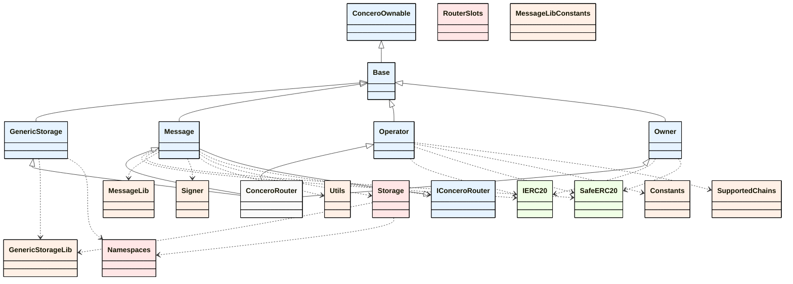

    Colors:
    - Core Contracts and Interfaces: #fafafa
    - Internal Libraries: #ffe6e6
    - Common Libraries: #fff0e6
    - Third-Party Dependencies: #f0ffe6
    
    Lines:
    - Inheritance Relationships: Solid Line
    - Usage Relationships: Dotted Line

