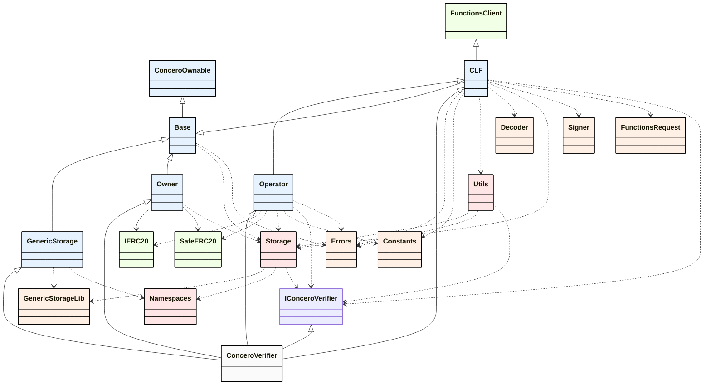

Colors: 
    - Core Contracts and Interfaces: #e6f3ff
    - Internal Libraries: #ffe6e6
    - Common Libraries: #fff0e6
    - Third-Party Dependencies: #f0ffe6
    - Main Class: #fafafa
Lines:
    - Inheritance Relationships: solid
    - Usage Relationships: dotted

