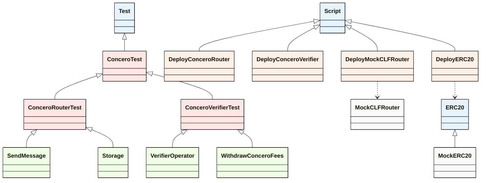

View diagram with [Mermaid Live Editor](https://mermaid.live/edit)

Colors:
 - Base Contracts: Blue
 - Abstract Contracts: Red
 - Test Contracts: Green
 - Deploy Scripts: Orange
 - Mock Contracts: White

Lines:
 - Solid Lines: Inheritance
 - Dashed Lines: Imports

